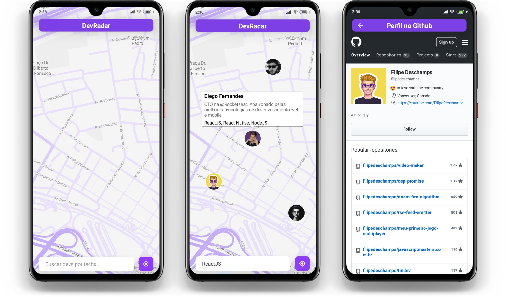

<h1 align="center">
    
</h1>

<h4 align="center">
  :round_pushpin: O DevRadar visa facilitar a busca por desenvolvedores por perto, o projeto foi desenvolvido durante a Semana OmniStack 10 da Rocketseat com layout pessoal.
</h4>

  
  

---

## :book: Tecnologias

Desenvolvido com:

- [Node.js](https://nodejs.org/en/)
- [React](https://reactjs.org)
- [React Native](https://facebook.github.io/react-native/)
- [Expo](https://expo.io/)

## :art: Layout

Todo o layout da aplicação foi desenvolvido no Figma e pode ser acessado através [desse link](https://www.figma.com/file/WzGQXO3TRaWwSi50XuB2f4/Semana-OmniStack?node-id=0%3A1).

## :memo: Licença

Esse projeto está sob a licença MIT. Veja o arquivo [LICENSE](LICENSE.md) para mais detalhes.
